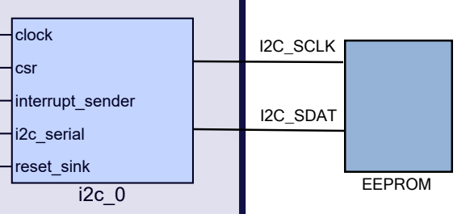
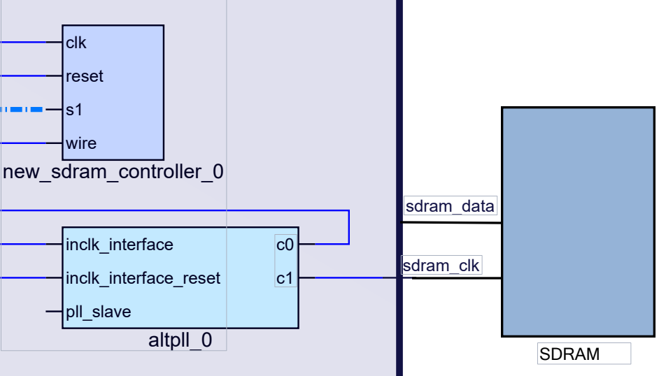

# Embedded System

This project involved first defining and connecting embedded hardware to various components on an Altera DE2-115 board, and then programming said components in C and VHDL to perform a variety of simple tasks. \

## Embedded Hardware

A Nios-11/e processor is added and connected to on-chip RAM. Next, a range of I/O peripherals including switches, LEDs, seven-segment displays, and a timer are all connected to the processor. The Recommended Standard 232 (RS-232) interface, a common serial communication medium is added to allow transmission of data between these components and the processor. I2C, or Inter-Itegrated Circuit, is another communication protocol added and used. Two other interfaces in Electrically Erasable Programmable Read-Only Memory (EEPROM) and Synchronous Dynamic Random-Access Memory (SDRAM) are supported and added for differing options in accessing and manipulating the system's memory. On top of this, a Direct Memory Access (DMA) controller is connected to the processor and all I/Os to give each direct access to memory. \

Two block diagrams illustrating how the EEPROM and SDRAM device connect are given below: \

## Embedded Software

An interactive menu is developed in C and allows the user to choose one of several tasks, that are summarized by the screenshot below: \

 

